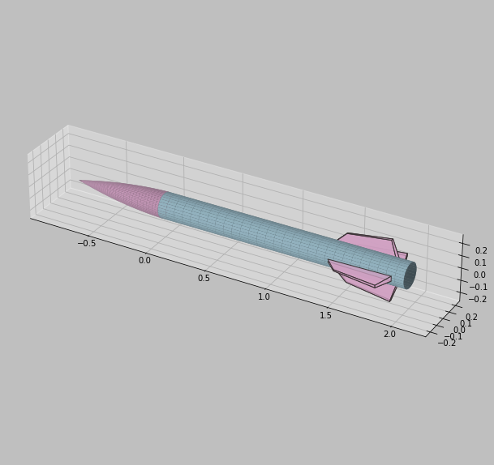

# 3D Rocket Visualization

---

### Introduction

This repository contains a Python script for visualizing a 3D rocket model. The script uses libraries such as NumPy and Matplotlib to create a detailed 3D representation of the rocket.

### Project Overview

The goal of this project is to visualize a rocket model in 3D, showcasing various components, including the cylinder body, flexible fins, and nose cone. The script provides a detailed visualization, allowing you to modify the rocket's geometry.
This script will be used for finding the optimal fin shape for my stabilization system. 
